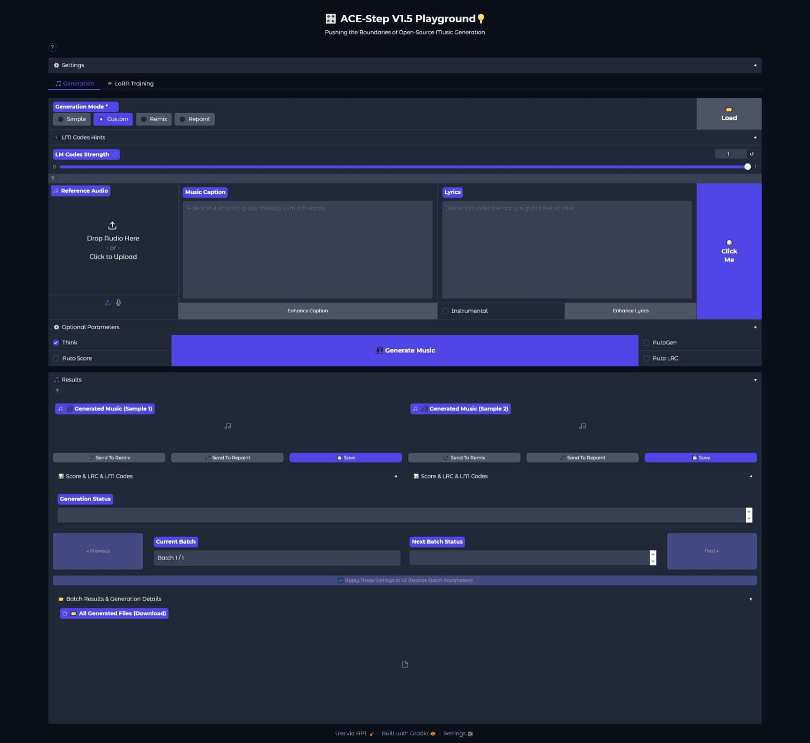

<h1 align="center">ACE-Step 1.5 Portable</h1>
<h1 align="center">Pushing the Boundaries of Open-Source Music Generation</h1>

    

  🟢 <a href="https://github.com/LeeAeron/AceStep"><strong>Torch 2.7.1 CUDA 12.8</strong></a> &nbsp;&nbsp;|&nbsp;&nbsp;
  🔵 <a href="https://github.com/LeeAeron/AceStep/tree/torch280"><strong>Torch 2.8.0 CUDA 12.8</strong></a> &nbsp;&nbsp;|&nbsp;&nbsp;
  🟠 <a href="https://github.com/LeeAeron/AceStep/tree/torch2100"><strong>Torch 2.10.0 CUDA 13.0</strong></a>

## 🔧 About
🚀 ACE-Step v1.5, a highly efficient open-source music foundation model that brings commercial-grade generation to consumer hardware. On commonly used evaluation metrics, ACE-Step v1.5 achieves quality beyond most commercial music models while remaining extremely fast—under 2 seconds per full song on an A100 and under 10 seconds on an RTX 3090. The model runs locally with less than 4GB of VRAM, and supports lightweight personalization: users can train a LoRA from just a few songs to capture their own style.

🌉 At its core lies a novel hybrid architecture where the Language Model (LM) functions as an omni-capable planner: it transforms simple user queries into comprehensive song blueprints—scaling from short loops to 10-minute compositions—while synthesizing metadata, lyrics, and captions via Chain-of-Thought to guide the Diffusion Transformer (DiT). ⚡ Uniquely, this alignment is achieved through intrinsic reinforcement learning relying solely on the model's internal mechanisms, thereby eliminating the biases inherent in external reward models or human preferences. 🎚️

🔮 Beyond standard synthesis, ACE-Step v1.5 unifies precise stylistic control with versatile editing capabilities—such as cover generation, repainting, and vocal-to-BGM conversion—while maintaining strict adherence to prompts across 50+ languages. This paves the way for powerful tools that seamlessly integrate into the creative workflows of music artists, producers, and content creators. 🎸

### 🎛️ Versatility & Control

| Feature | Description |
|---------|-------------|
| ✅ Reference Audio Input | Use reference audio to guide generation style |
| ✅ Cover Generation | Create covers from existing audio |
| ✅ Repaint & Edit | Selective local audio editing and regeneration |
| ✅ Track Separation | Separate audio into individual stems (with BASE model) |
| ✅ Multi-Track Generation | Add layers like Suno Studio's "Add Layer" feature |
| ✅ Vocal2BGM | Auto-generate accompaniment for vocal tracks |
| ✅ Metadata Control | Control duration, BPM, key/scale, time signature |
| ✅ Simple Mode | Generate full songs from simple descriptions |
| ✅ Query Rewriting | Auto LM expansion of tags and lyrics |
| ✅ Audio Understanding | Extract BPM, key/scale, time signature & caption from audio |
| ✅ LRC Generation | Auto-generate lyric timestamps for generated music |
| ✅ LoRA Training | One-click annotation & training in Gradio. 8 songs, 1 hour on 3090 (12GB VRAM) |
| ✅ Quality Scoring | Automatic quality assessment for generated audio |

## 🔧 Key Differences from Official AceStep 1.5

- Optimized for all systems with nVidia GPUs
- Main `.bat` menu with option to advanced install/reinstall project/pre-configured and manual start
- Pre-configured to work out-of box to get easy user experience and better quality
- Unlocked features for LowRAM PCs
- Fully portable without any trash in system

## ✅ Supported Models

- All official AceStep models, re-uploaded onto own repository and official ModelScope.

## ⚙️ Installation
AceStep 1.5 Portable uses Python 3.11 with Torch 2.7.1/2.8.0/2.10.1 Cuda 12.8 (by demand).

AceStep 1.5 Portable supports nVidia GTX and RTX cards, including GTX10xx-16xx and RTX 20xx–50xx.

### 🖥️ Windows Installation

This project provided with only *.bat installer/re-installer/starter/updater file, that will download and install all components and build fully portable AceStep 1.5 Portable.

➤ Please Note:
    - I'm supporting only nVidia GTX10xx-16xx and RTX20xx-50xx GPUs.
    - This installer is intended for those running Windows 10 or higher. 
    - Application functionality for systems running Windows 7 or lower is not guaranteed.

- Download the AceStep .bat installer for Windows in [Releases](https://github.com/LeeAeron/AceStep/releases).
- Place the BAT-file in any folder in the root of any partition with a short Latin name without spaces or special characters and run it.
- Select INSTALL (4) entry, and select desired Torch version. .bat file will download, unpack and configure all needed environment.
- After installing, select START (UI) (1). .bat will loads necessary models, and will start Browser with AceStep Gradio UI.
- START (API) (2) will start AceStep in API mode. You can edit API configs in .bat file.
- START in Model Edit Mode brings enhanced model choice to run.

## ⚙️ NOTE:
- AceStep 1.5 Portable pre-configured to use acestep-v15-sft and acestep-5Hz-lm-1.7B models out-of-box.
- AceStep 1.5 Portable will download base models at first start: AceStep Turbo, AceStep Vae, Qwen3 Embedding, AceStep-5Hz-lm-0.6B and AceStep-5Hz-lm-1.7B.

## ♻️ UPDATES:
- AceStep 1.5 Portable will be periodically updated to be synced with main AceStep project.
- You can update AceStep 1.5 Portable main code from .bat menu by UPDATE (5) menu entry.
- As main prooject developing very fast, there will be some time time lag in updates here, sorry guys.

### 💡 Which Model Should I Choose?

| Your GPU VRAM | Recommended LM Model | Backend | Notes |
|---------------|---------------------|---------|-------|
| **≤6GB** | None (DiT only) | — | LM disabled by default; INT8 quantization + full CPU offload |
| **6-8GB** | `acestep-5Hz-lm-0.6B` | `pt` | Lightweight LM with PyTorch backend |
| **8-16GB** | `acestep-5Hz-lm-0.6B` / `1.7B` | `vllm` | 0.6B for 8-12GB, 1.7B for 12-16GB |
| **16-24GB** | `acestep-5Hz-lm-1.7B` | `vllm` | 4B available on 20GB+; no offload needed on 20GB+ |
| **≥24GB** | `acestep-5Hz-lm-4B` | `vllm` | Best quality, all models fit without offload |

The UI automatically selects the best configuration for your GPU. All settings (LM model, backend, offloading, quantization) are tier-aware and pre-configured.

> 📖 GPU compatibility details: [English](./docs/en/GPU_COMPATIBILITY.md)

But, AceStep 1.5 Portable brings unlocked feature to use heaviest models for users with 32Gb+ RAM in offload mode. I'm not restricting You to try biggest model on your hardware.

## 📖 Tutorial

**🎯 Must Read:** Comprehensive guide to ACE-Step 1.5's design philosophy and usage methods.

| Language | Link |
|----------|------|
| 🇺🇸 English | [English Tutorial](./docs/en/Tutorial.md) |

This tutorial covers: mental models and design philosophy, model architecture and selection, input control (text and audio), inference hyperparameters, random factors and optimization strategies.

## 🔨 Train

📖 **LoRA Training Tutorial** — step-by-step guide covering data preparation, annotation, preprocessing, and training:

| Language | Link |
|----------|------|
| 🇺🇸 English | [LoRA Training Tutorial](./docs/en/LoRA_Training_Tutorial.md) |

See also the **LoRA Training** tab in Gradio UI for one-click training, or [Gradio Guide - LoRA Training](./docs/en/GRADIO_GUIDE.md#lora-training) for UI reference.

🔧 **Advanced Training with [Side-Step](https://github.com/koda-dernet/Side-Step)** — CLI-based training toolkit with corrected timestep sampling, LoKR adapters, VRAM optimization, gradient sensitivity analysis, and more. See the [Side-Step documentation](./docs/sidestep/Getting%20Started.md).

## 🦁 Model Zoo

### DiT Models

| DiT Model | Pre-Training | SFT | RL | CFG | Step | Refer audio | Text2Music | Cover | Repaint | Extract | Lego | Complete | Quality | Diversity | Fine-Tunability | Hugging Face |
|-----------|:------------:|:---:|:--:|:---:|:----:|:-----------:|:----------:|:-----:|:-------:|:-------:|:----:|:--------:|:-------:|:---------:|:---------------:|--------------|
| `acestep-v15-base` | ✅ | ❌ | ❌ | ✅ | 50 | ✅ | ✅ | ✅ | ✅ | ✅ | ✅ | ✅ | Medium | High | Easy | [Link](https://huggingface.co/LeeAeron/acestep-v15-base) |
| `acestep-v15-sft` | ✅ | ✅ | ❌ | ✅ | 50 | ✅ | ✅ | ✅ | ✅ | ❌ | ❌ | ❌ | High | Medium | Easy | [Link](https://huggingface.co/LeeAeron/acestep-v15-sft) |
| `acestep-v15-turbo` | ✅ | ✅ | ❌ | ❌ | 8 | ✅ | ✅ | ✅ | ✅ | ❌ | ❌ | ❌ | Very High | Medium | Medium | [Link](https://huggingface.co/LeeAeron/Ace-Step1.5) |

### LM Models

| LM Model | Pretrain from | Pre-Training | SFT | RL | CoT metas | Query rewrite | Audio Understanding | Composition Capability | Copy Melody | Hugging Face |
|----------|---------------|:------------:|:---:|:--:|:---------:|:-------------:|:-------------------:|:----------------------:|:-----------:|--------------|
| `acestep-5Hz-lm-0.6B` | Qwen3-0.6B | ✅ | ✅ | ✅ | ✅ | ✅ | Medium | Medium | Weak | ✅ |
| `acestep-5Hz-lm-1.7B` | Qwen3-1.7B | ✅ | ✅ | ✅ | ✅ | ✅ | Medium | Medium | Medium | ✅ |
| `acestep-5Hz-lm-4B` | Qwen3-4B | ✅ | ✅ | ✅ | ✅ | ✅ | Strong | Strong | Strong | ✅ |

## 🙏 Acknowledgements

This project is based on AceStudio which co-led by ACE Studio and StepFun.

## 📺 Credits

* [LeeAeron](https://github.com/LeeAeron) — porting, syncing, modding, coding (.bat and main code enhance).
* [AceStep1.5](https://github.com/ace-step) - main project, models.

## 📝 License

The **AcedStep 1.5 Portable** code is released under MIT License. 
